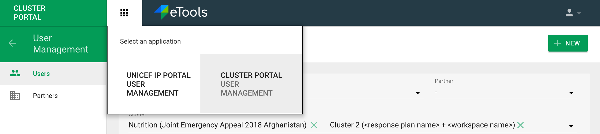

# User Interface

The overall user interface for User Management in Cluster Portal consists of the following sections, depending on role of logged in person. The user will get here via the Cluster Reporting interface with ID Management option in the left hand navigation. The first super admin user will be added via Django admin. Then this user should be able to add other cluster members, viewers, coordinators etc. along with IMO's as well.

**Header** with:

* profile dropdown,
* name of organization that logged in person belongs to \(if this person is a Partner user\),
* app icon to switch to User Management for IP Reporting if this user has appropriate permission.

**Left navigation** with:

* button with an arrow to go back from User Management to Cluster Portal interface,
* Users
* Partners \(only for internal users - Cluster super admin and IMO\) 

  

