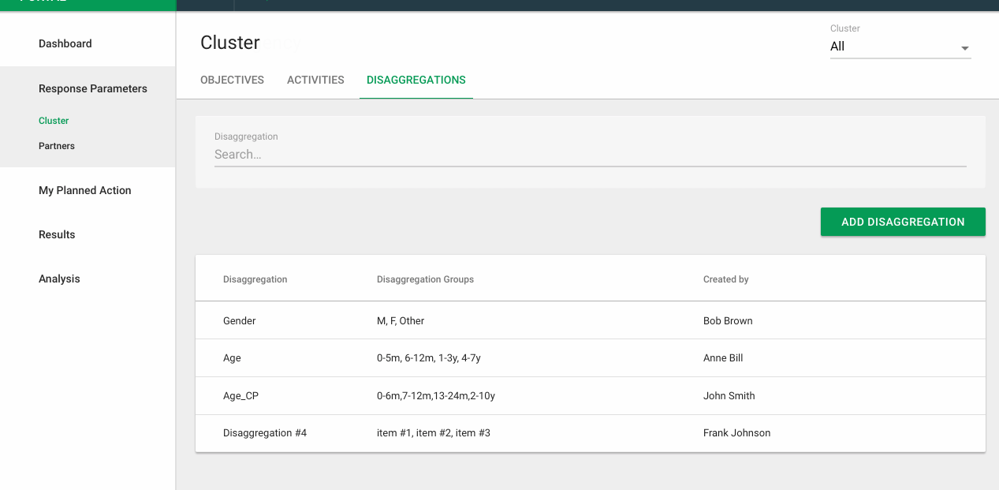

# Disaggregations

In some cases data reported by the partner for an indicators progress needs to be broken down further and not just be a total number.

This concept is referred to as disaggregated data reporting. An example of what that might look like for say data broken by age, gender, height \(made up scenario\) is as shown below.

The PRP system supports up to three disaggregations per indicator. Each disaggregation can contain any number of disaggregation groups \(options\). The partner is then expected to report data for the specified disaggregations. It it possible though for the partner to choose to report at a lower or no \(totals only\) disaggregation as well, since they may not have the granular data available.

In either case for a particular indicator report for one location, the progress against targets is always the total that is calculated by summing the disaggregated data.

## Defining Disaggregations

For IP reporting the disaggregations are defined by the PO in the PMP system. PRP simply picks these disaggregations up and uses them.

For cluster reporting though the IMO can define these disaggregations for the entire response and then use these in a consistent manner for the indicators they or the partners create in any cluster within the response plan.

