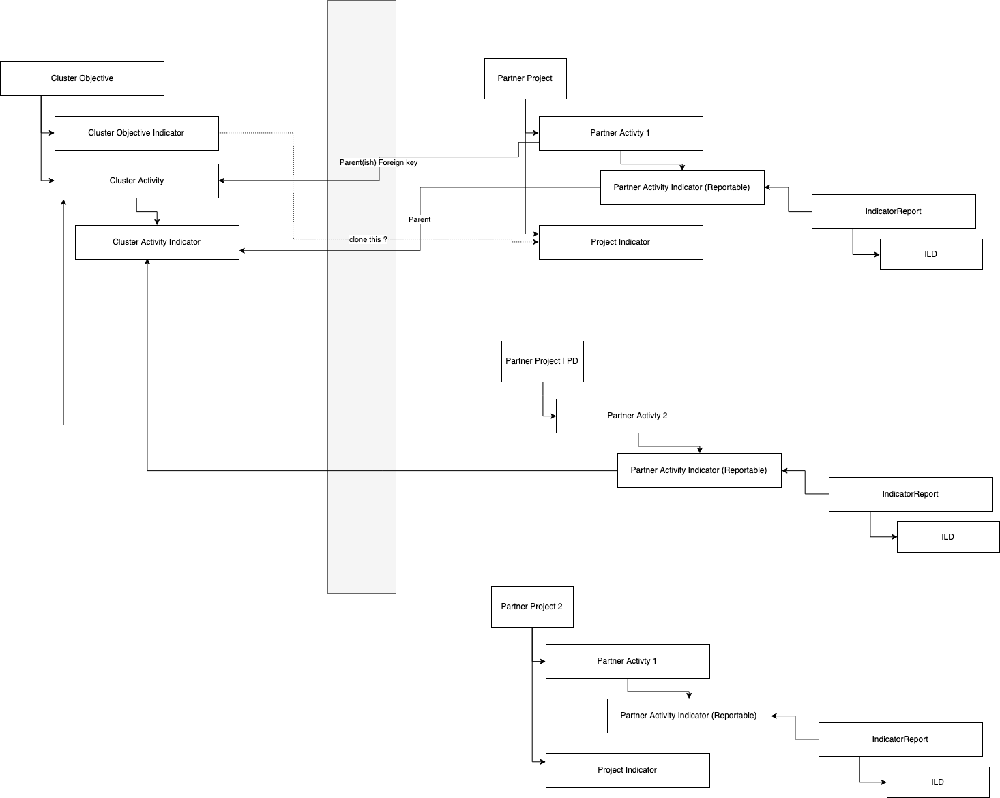

# Reporting with Partner Project Contexts

This will describe how Cluster reporting will be affected in order to support reporting on Partner Activity Indicator at multiple Partner Projects.

## Background

PRP was originally designed to report Cluster indicator report with 1 associated Partner Project for 2 reasons:

* Dual reporting between IP reporting and Cluster reporting via Cluster Indicator
* OCHA Partner Project importing

Currently, OCHA import works as it follows:

* Cluster Response Plan is imported first
  * Clusters are created
  * Cluster objectives and Cluster activities for the response plans are created
* At this point, cluster activities exist in the PRP Cluster reporting
* We call OCHA V2 Partner Project Attachment API
* Look up each attachment type and if it is indicator then we start importing process
* We first look up by attachment Object ID (Cluster Activity Object ID) to see if there is any ClusterActivity in PRP
  * Cluster activities may be created when the response plan is imported
* We create or update Reportable with Partner Project type in PRP
* If we found Cluster Activity for this Partner Project Indicator, then create or update Partner Activity Indicator under current Partner Project.

PRP system automatically adopts Cluster Activity indicator to create a Partner Activity indicator, if Programme Document in IP reporting has Cluster indicator information from PRP. Same goes to OCHA importing as well, which also automatically adopts Cluster Activity indicator from HPC Partner Project API data to create a Partner Activity indicator. This auto-adoption works on only 1 Partner Project to link between Cluster Activity and Partner Activity, due to current database model constraint and dual reporting logic.

Now from latest pilot feedbacks, the Partners have a single activity under more than 1 Projects simultaneously. This is due to their activities satifying progress in different location segments per each in multiple projects.

## Functional changes

### Affected modules

* PD sync task
* OCHA Partner Project import
* Cluster UIs for Partner Activity and Partner Project, including their Indicator and Indicator Report UIs
* Dual reporting logic

### Data model

* No major model changes needed since there are no DB constraints to be removed.

### Data Sync

* OCHA Partner Project import will create Partner Project Indicator for a project, and then will do the followings:
  * If there is no Cluster Activity found from this Project Indicator, then PRP will not create Partner Activity. (i.e OCHA data discrepancies)
    * TODO: This may need a confirmation from OCHA about there should not be a discrepancy between Cluster Activity object and Project Indicator.
  * If there is no Partner Activity for this project and cluster activity, then PRP will auto-adopt.
  * Only create missing Partner Activity Indicators for the Partner Activity which matches Cluster Activity from this Project Indicator. (Per-Indicator basis)
    * OCHA Partner Project import will not trigger cloning Cluster Activity indicators to Partner Activity indicators
    * Assuming both PRP and OCHA have same copies of indicator information per cluster activity, I think it's ok. By importing OCHA Partner Project indicators with cluster activity flag, this is essentially same as cloning cluster activity indicators as partner project indicators.
* When Partner Project indicators get updated, no associated Partner Activity indicators will be updated. They are a separate copy of Indicators.
* Ideally, locations from its Cluster Activity will be same as the ones from Partner Project.
  * Locations for Cluster Activity and Partner Project come from OCHA, so it is safe to assume they will be matched up. If Partner Project has more locations than associated Cluster Activity has, then Partner Activity for Cluster Activity will receive extra from Partner Project.
    * The future reports will be reflecting such changes.
* When Programme Document background sync happens from PMP, a new Partner Project will be created if there is no partner project under its Programme Document ID. In other words, Partner Activity indicator for this Cluster Activity indicator will be duplicated per Programme Document in Cluster reporting.
  * The Project title and description will be borrowed from Programme Document.
  * External ID and Source information will be UNICEF.
  * Partner Activity Indicator will be created under this new Partner Project.
  * A new Partner Project Indicator will be created based on the Cluster Activity Indicator, and Partner Activity Indicator will be linked to this Partner Project Indicator.
  * If Partner Project already exists under current Programme Document, then PRP will not create a new Partner Project and attempt to adopt Partner Activity Indicator if the Project does not have this adoption.

### Data validation

* Replace a validation to check only one Partner Activity from Cluster Activity for Partner level to Partner Project level.
* For creating Partner Activity in Cluster reporting, Partner Project dropdown form field in the modal UI will be multi-selectable.
  * If any of selected Partner Projects already have a selected Cluster Activity, then PRP will throw an error as illegal state.
* When creating Custom Partner Project Indicator, there will be an option to adopt 1 Indicator at a time from selected Cluster Objective as Partner Project indicator.
  * There will be no automatic total sync between Partner Project Indicator and Cluster Objective Indicator.

### Data reporting

* `Reporting on Results` UI will now include Partner Project contexts. This is simply to add PROJECT label to current list row UI for indicator reports.
  * Project list filter UI will be added in this page.
* Indicator list UI in Partner Activity will not show project information. Totals and progress won't be affected.
* `Enter Data` modal UI will be changed to hide `Percentage funded by` subsection since the dual reporting is no longer possible. Instead, PRP will assume 100% of entered data to be passed into linked Indicator reports between Cluster and IP reporting.
  * Instead, 100% of entered data will be synced to IP/Cluster indicator report for the UNICEF PD partner project and vice versa.
* Partner Activity Indicator total will contribute to its Cluster Activity Indicator only. Partner Project Indicator won't be contributed.
* Cluster Analysis Indicator UI will now incorporate `Project` list filter UI and the indicator analysis data will be grouped by Partner Project.
  * This also means cluster indicator data analysis need to have Project contexts.
* Partner Activity data entry will not contribute to Partner Project data.

------------------------------------------------

### Model change diagrams

