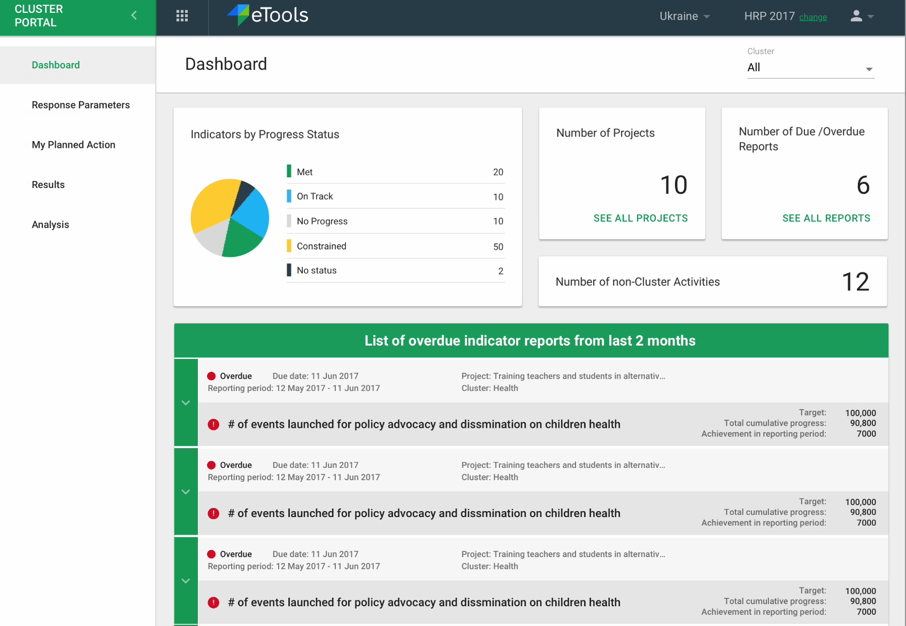
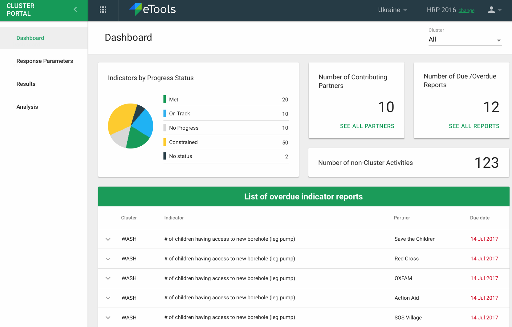

# Response Plan Dashboard

In this section \("Dashboard" in the left hand navigation\) of the interface an IMO or a signed in partner can see an overview of the response. Depending on whether a partner or an IMO has signed in, a slightly different dashboard will show.

### Partner Dashboard

The Partner will be shown the following:

* Number of non-Cluster Activities
* Number of Projects
* Number and list of due/overdue indicator reports
* Indicators by Progress Status

### IMO Dashboard

The IMO user will be shown the following:

* Number of Contributing Partners
* List and Number of due/overdue indicator reports
* Number of non-Cluster Activities
* Indicator by Progress Status

