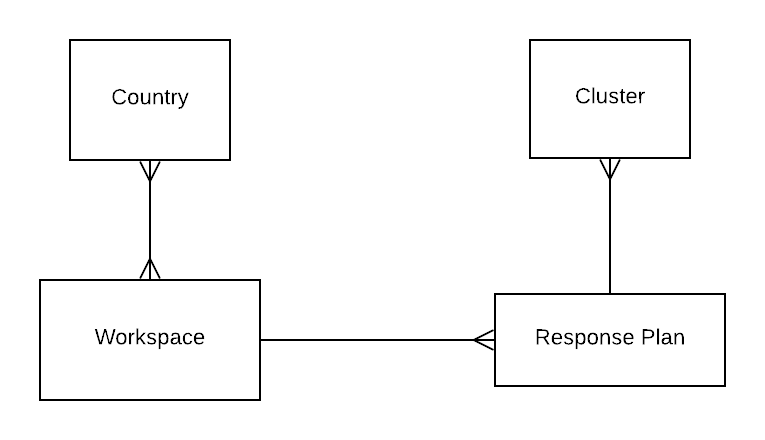

# Overview

The goal of Cluster Reporting in PRP is to enable IMO’s and Partners to report on various indicators and have access to the necessary data they need to accomplish their tasks. When data is submitted,  it is shared with PMP.

Both IMO’s and Partners have access to Cluster Reporting and can view all data for their respective organizations.

Partners can add

* Custom Project or Import from OCHA
* Custom Activities 
* Report on Project and Activity Indicators for their organization
* Disaggregations

IMOs can add

* Custom Project or Import from OCHA on behalf of partners
* Custom Activities 
* Report on all Indicators for their cluster
* Disaggregations

For more details, view the[ roles and permissions](https://unicef.gitbook.io/prp/product-end-user-documentation/cluster-reporting/roles-and-permissions).**  
**

### Core Data Concepts

Below a visual representation of the core data concepts relating to cluster reporting.  A workspace consists of one or more countries. Each workspace then can have one or more response plans. And each response plan will have one or more clusters associated with it.

