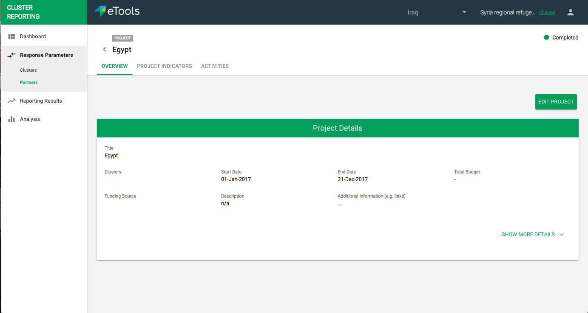

# Planning your action as a Partner

In this section \("My Planned Action" in the left hand navigation\) of the interface is where the partner can view and setup their planned actions to support the work of the cluster. A checkmark will indicate whether a project is from OCHA. The IMO does not see this section.


This section is only visible to a partner user who is logged in.


If we do have OCHA external ID, Partner can proceed with creating a project from OCHA or a custom project. If we don’t have OCHA external ID, Partner will have to create custom project.

Business Analyst from UNICEF side will add the Organisation ID from [https://api.hpc.tools/v1/public/organization](https://api.hpc.tools/v1/public/organization) as OCHA External ID field in PRP Django Admin. 

We will show basic details in a drop down so the partner knows which project they are pulling from OCHA. 

We will include all names of Funding Source because there might be multiple sources. Funding Source is not always available though so it will be optional. Total funding is not always available so it will be optional too. User can edit the funding source and total funding.

Custom Project will need to have 

* Title
* Clusters \(dropdown\)
* Start Date/End Date
* Status \(dropdown\)
* Description
* Additional Information Field \( ability to add more\)
* And options for see more

Optional fields include

* Name Of Agency \(dropdown of acronyms\)
* Type of Agency \(dropdown\)
* Additional implementing partners
* Project part of HP or FA \(radio button\)
* Prioritization classification \(dropdown\)
* Project code in HRP \(dropdown\)
* Funding Requirements \(in US$\)
* Funding received/confirmed from CERF \(US$\)
* Funding received / confirmed from bilateral agreements, not including UNICEF/WFP \(US$\)
* Funding received / confirmed from UNICEF including supplies cost  \(US$\)
* Funding received / confirmed from WFP including supplies cost  \(US$\)
* Funding gap \(US$\)

The project details can be editable.

### 

### Project Activities

Within a project the partner can add activities they are conducting. Partners would only select from a cluster activity list if adding them to a project.

They can choose to adopt a cluster activity or create a custom activity of their own.

If the Partner selects from a Cluster Activity, we will to show

* Cluster \(dropdown\)
* Activity \(dropdown\)
* Partner Project \(dropdown\)
* Start/End date
* Status \(dropdown\)

For Custom Activity, Partner will include

* Cluster \(dropdown\)
* Activity \(dropdown\)
* Partner Project \(dropdown\)
* Start/End date
* Status \(dropdown\)

Partner can edit project afterwards and hide details

  

