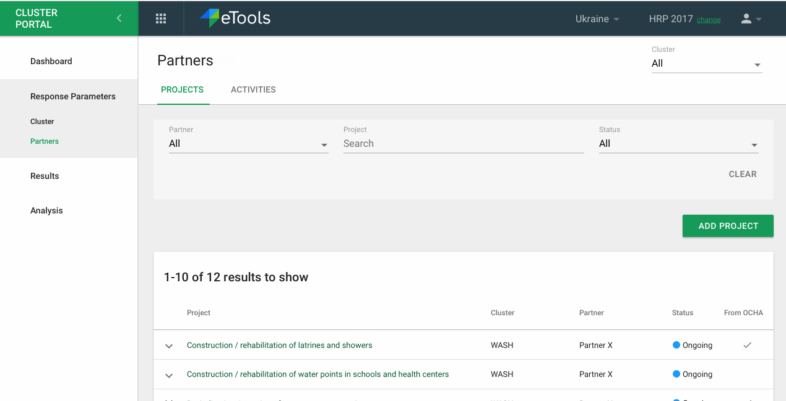
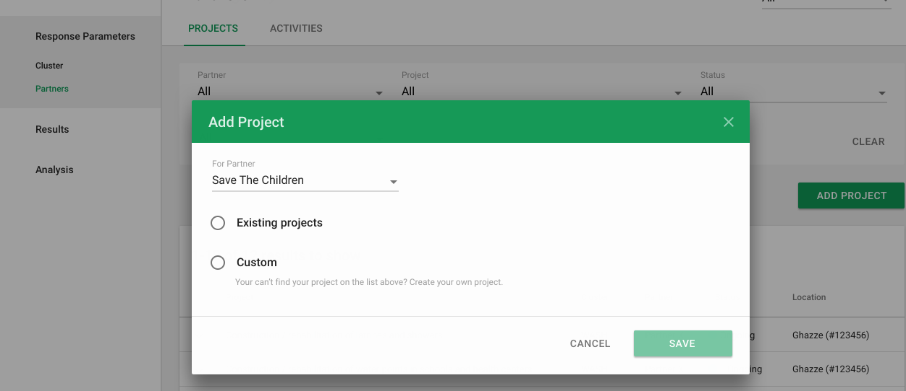
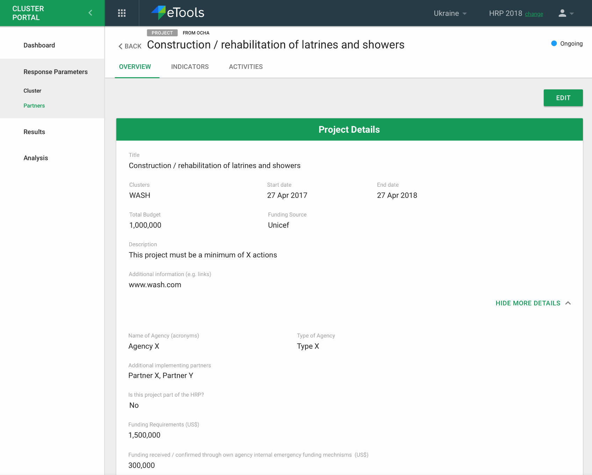
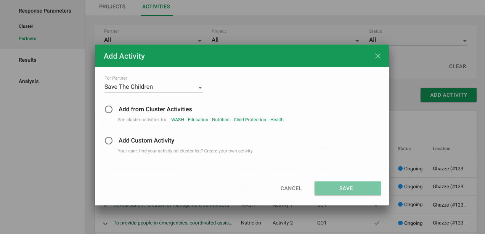

# Response Parameters setup

In this section \("Response Parameters" in the left hand navigation\) of the interface all the response parameters of this response plan can be viewed. These are the cluster objectives, cluster activities, partner projects and partner activities along with the indicators that are associated with it.

At the top left, one can select which cluster they'd like to view all the data for. There filters available on each list view as well.

### Clusters

Cluster objectives, activities and disaggregations are the primary component in Response Parameters. The IMO can create any of these and partners can view this data.

IMOs can set Disaggregations here in once place for the entire response plan.

### Partners

This represents a place where any signed in user can view all partner projects and activities for this response plan.

### Adding a Project for a Partner as an IMO

IMO can add a project for partners \(within their cluster?\) from the response parameter section.

IMO chooses the partner and if the project is existing to be pulled from OCHA or a new custom project. Please see [OCHA integration](ocha-integration.md) for more details.

**\(TBD Maciej: Need to confirm we can filter the projects for a specific partner in OCHA so we can pull the data successfully\)**

If the IMO pulls a project from OCHA, they will be able to choose from a list of projects pertaining to that partner and see details for that project. This flow / screens / fields etc. \(other than the partner dropdown\) are exactly the same as what the partner would do. Please see [here](planning-your-action-as-a-partner.md) for more details.

IMO can edit project afterwards as well.

### Adding an Activity for a Partner as an IMO

**\(TBD Maciej: still researching Partner activities for OCHA integration\)**

The IMO can add activities for partners \(within their cluster\) as well.

They can select the partner and then choose to add from Cluster Activities or a Custom activity. This flow / screens / fields etc. \(other than the partner dropdown\) are exactly the same as what the partner would do. Please see [here](planning-your-action-as-a-partner.md) for more details.

IMO can edit project afterwards as well.

 

