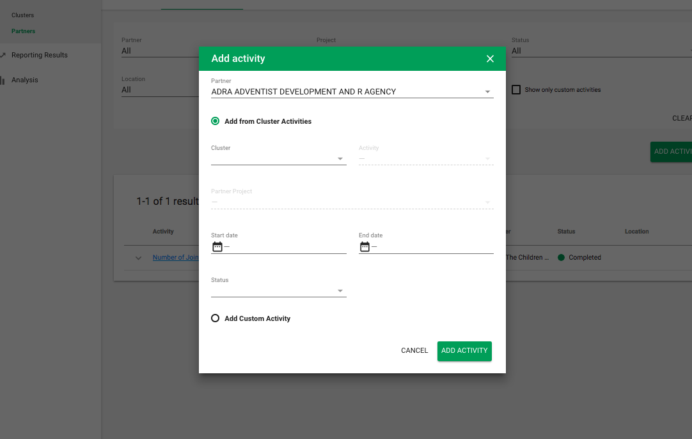

# Response Parameters setup

Response Parameters gives IMO access to plan, define, and execute: 

* Cluster Objectives and indicators that are associated with it
* Cluster Activities and indicators that are associated with it
* Disaggregations 
* Partner Projects and indicators that are associated with it
* Partner Activities and indicators that are associated with it

The Partner can see all of this data but only add/edit Partner Projects, Project Indicators, Partner Activities, Partner Activity Indicators pertaining to them.

At the top right, one can select which cluster they'd like to view all the data for. There filters available on each list view as well.

### Clusters

Cluster objectives, activities and disaggregations are the primary component in Response Parameters. The IMO can create any of these and partners can view this data.

IMOs can set Disaggregations here in once place for the entire response plan.

### Partners

This represents a place where any signed in user can view all partner projects and activities for this response plan.

### Adding a Project for a Partner as an IMO

IMO can add a project for partners \(within their cluster\) from the response parameter section.

IMO can choose the partner they would like to create a project for. If we do have OCHA external ID, IMO can proceed with creating a project from OCHA or a custom project. If we don’t have OCHA external ID, IMO will have to create custom project.

Business Analyst from UNICEF will add the Organisation ID from [https://api.hpc.tools/v1/public/organization](https://api.hpc.tools/v1/public/organization) as OCHA External ID field in PRP Django Admin. 

Please see [OCHA integration](ocha-integration.md) for more details. 

If the IMO pulls a project from OCHA, they will be able to choose from a list of projects pertaining to that partner and see details for that project. This flow / screens / fields etc. \(other than the partner dropdown\) are exactly the same as what the partner would do. Please see[ here](https://unicef.gitbook.io/prp/product-end-user-documentation/cluster-reporting/planning-your-action-as-a-partner) for more details.

IMO can edit project afterwards as well.

### Adding an Activity for a Partner as an IMO

The IMO can add activities for partners \(within their cluster\) as well.

They can select the partner and then choose to add from Cluster Activities or a Custom activity. This flow / screens / fields etc. \(other than the partner dropdown\) are exactly the same as what the partner would do. Please see [here](planning-your-action-as-a-partner.md) for more details. 

IMO can edit project afterwards as well.

 

