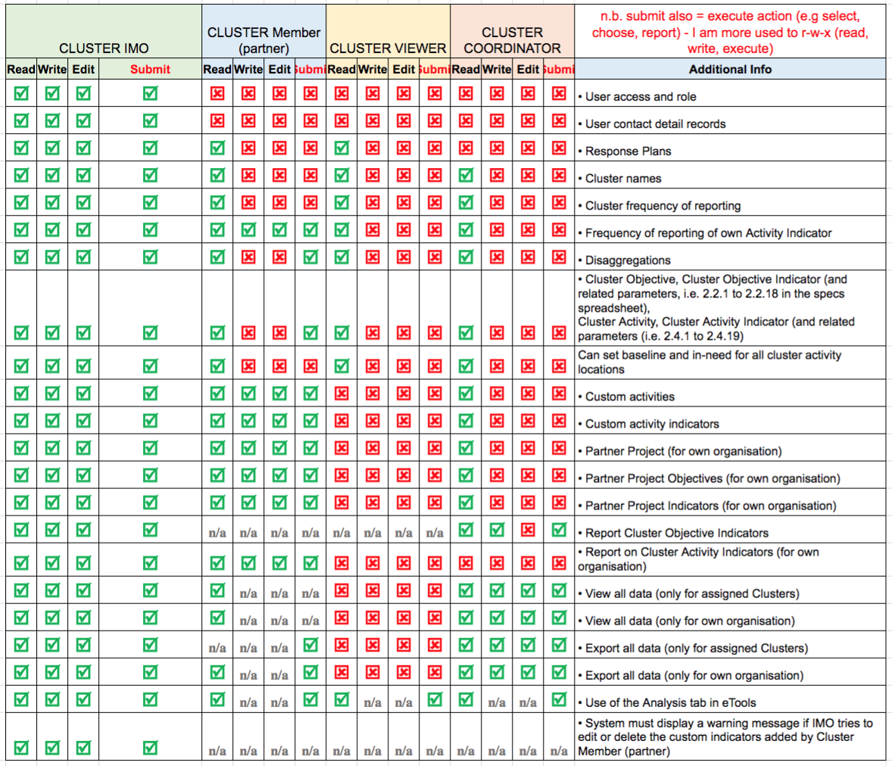

# User Authentication, Roles and permissions

### Authentication

The users on PRP Cluster Reporting can login via:

* Their email \(get a unique link clicking which they can login\) - TODO: will be deprecated.
* Active Directory \(AD\) - will further integrate with HID \(Humanitarian ID\) or other oauth ID provider.

PRP will integrate with AD for identity of the users. Roles will continue to be defined in the application itself via Django admin. See [AD Integration](ad-integration.md) for more details.

### User Role Management \(Django Admin\)

What role they have on PRP or which partner they belong to is all managed in the Django Administrative interface.

### Roles and Permissions

  
The below table represents the **4 roles** that PRP Cluster Reporting supports and the capabilities / available actions enabled for each:

[https://docs.google.com/spreadsheets/d/1RKptCboJSAyNCWyenJ\_uRIZ\_hFiVt68t8W2m7C3Uyzc/edit?usp=sharing](https://docs.google.com/spreadsheets/d/1RKptCboJSAyNCWyenJ_uRIZ_hFiVt68t8W2m7C3Uyzc/edit?usp=sharing)

