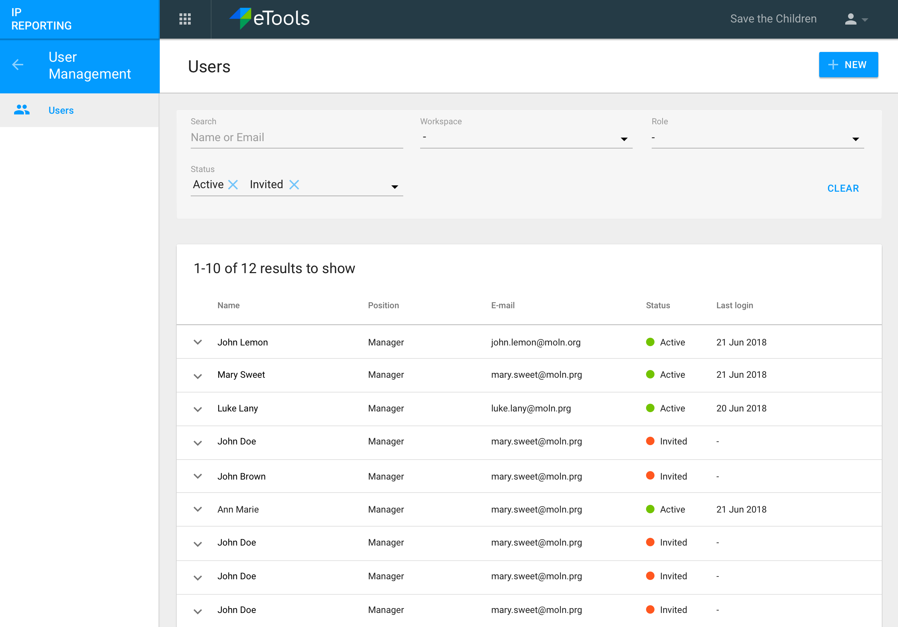
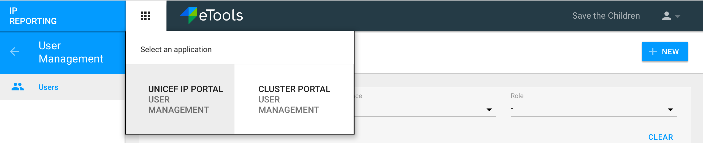

# User Interface

The overall user interface for User Management in IP Reporting consists of the following sections:

**Header** with:

* profile dropdown
* name of organization that logged in person belongs to,
* app icon to switch to User Management for Cluster Portal if this user has appropriate permission.

**Left navigation** with:

* button with an arrow to go back from User Management to IP Reporting interface,
* Users

