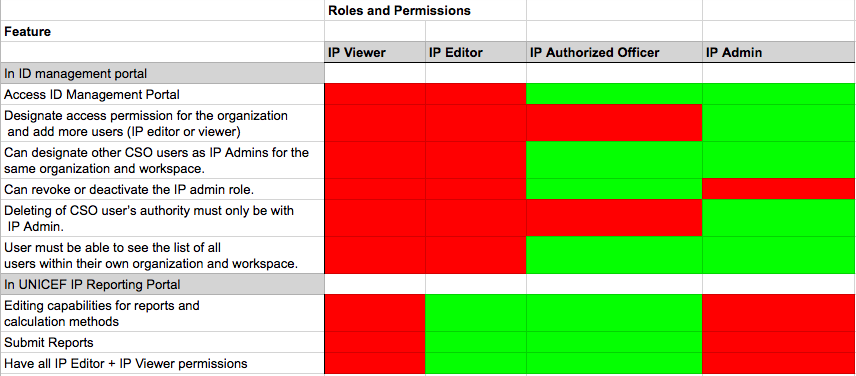

# Permissions

Permissions Matrix: [https://docs.google.com/spreadsheets/d/11kD7Eb\_GlxEB-xG0uCALTomPKOsa785GlIt2ipt0mm8/edit\#gid=0](https://docs.google.com/spreadsheets/d/11kD7Eb_GlxEB-xG0uCALTomPKOsa785GlIt2ipt0mm8/edit#gid=0)

AO details \(name, email\) are retrieved from PMP to ID Management. When AO is inactivated then the same happens with ID management portal as well.

### IP Permissions 

###  Cluster Permissions

