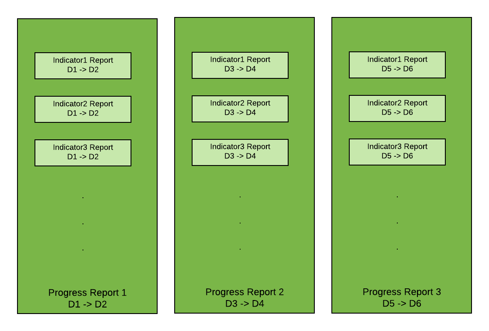
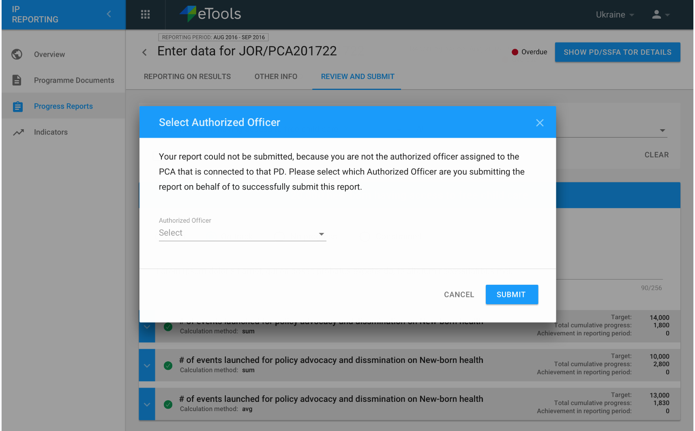
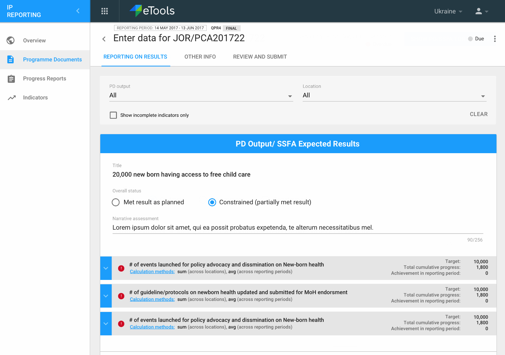

# Progress Reports

### Overview

Progress Reports are essentially a **container of one or more indicator reports**. The reporting period \(start -&gt; end date\) that this progress report is being submitted would be exactly the same range for all the included indicator reports.

In IP Reporting the individual indicator reports are not given any prominence, but under the hood thats what the partner is really reporting on. The following image shows the relationship at a high level. Please refer to the [date model](../../technical-documentation/data-model.md) for more details.

The user does not generate progress reports, but these are generated periodically/automatically for the partner based on the reporting periods and due dates set by the PO at UNICEF.


**Partners do not create progress reports** or indicator reports or for that matter anything in the IP Reporting interface. These are auto-generated for them at a frequency as setup/agreed upon in PMP and they have to come in and enter data for them in PRP.


### Report due date

Each progress report for a certain period has a due date. This date is decided as part of the PD setup by UNICEF. A report becomes overdue if not submitted by that date.

### Submitting a report

Once the partner has entered all the data associated with each indicator report in the progress report, along with other information like partner contribution/challenges/way forward and any attachment they would like to send as part of the report, they can then submit the progress report. At this point the partner will not be able to edit any data associated with this report.

The email of the person submitting the report should be checked against the email of the authorized officer assigned to the PCA that is connected to that PD. If the emails are the same, then the report is submitted. If the emails are different, then there is a pop up that ask the user to select which Authorized Officer is the user submitting the report on behalf of. The user can choose only 1 and submit.

#### Final Report Submission

The final report is generated then right after the end of the final reporting period and the PD has reached the "**ended**" status.

When submitting a final report the partner will be given slightly different options for overall status.

Once a final report has been generated, no change to the PD reporting periods should be allowed \(in PMP\) and hence the final report is really always the final one for the PD.

The term Lower Level Outputs, should not be used in IP. This should be PD Outputs/SSFA Expected Results. 

**Edge case** \(to be handled in a future release\): Super-users in PMP can make changes that might not be in alignment with above restrictions. If that were to happen then a manual administrative data fix might be required on the PRP side as well.

### Acceptance of a report

The UNICEF PO is responsible for acceptance of a progress report that has been submitted. This happens in the PMP system. The PO can also **send the report back with a note**, in which case the partner should get an email informing them that should review the note and re-submit the report \(data in the report becomes editable once its been sent back\). In that case the partner can log back in, make any changes recommended and resubmit the report back to UNICEF.

