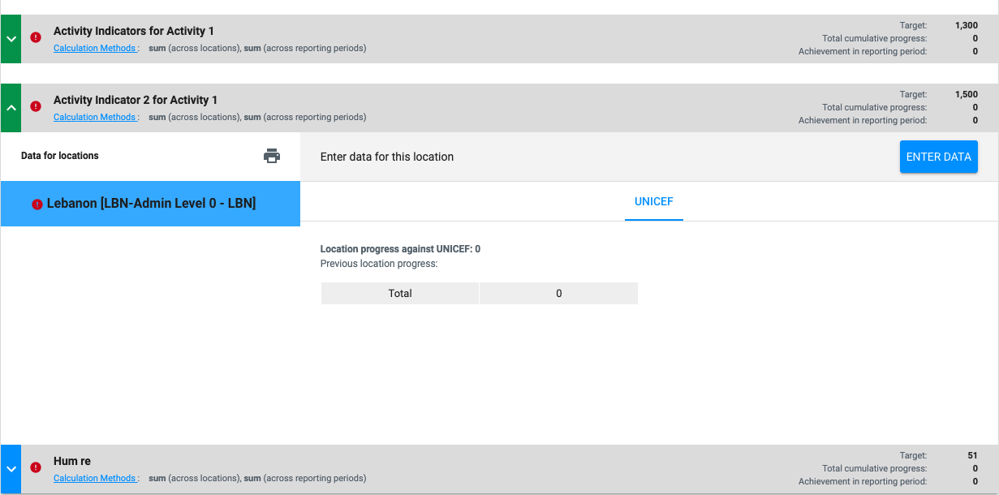
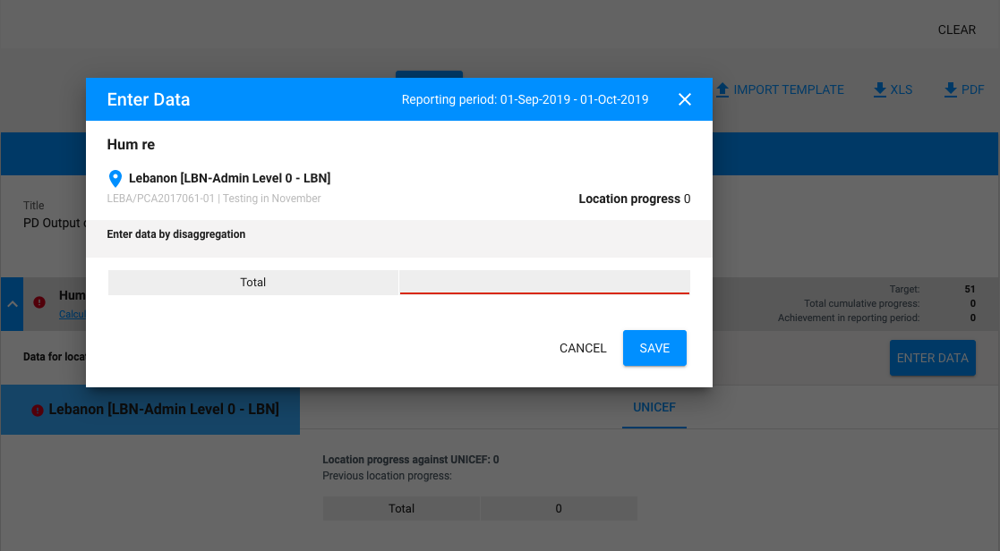

# Humanitarian Reports \(HR\)

This report type is used in humanitarian situations, when it is critical to receive data on the PD \(or SSFA if applicable\) progress at a higher frequency than quarterly. In this report, the IP provides the following information:

* For each PD output \(or SSFA expected result\), report progress only against humanitarian response indicators defined for the PD/SSFA in PMP, at the level of disaggregation defined, or less or above, if applicable. Humanitarian response indicators are only those defined as:
  * “cluster indicators”
  * UNICEF specific “high-frequency humanitarian response indicators” in PMP.

The structure of this report is simplified compared to the standard QPR. This report does not include PD output rating or narrative assessment of progress and there is no “other info" tab in the user interface for this report. The tab in the PD report page called “Reporting on Results” must be renamed to “Reporting on Indicators”.

There is no workflow following the submission by the IP to UNICEF and Cluster. HR’s status can be set to “Received”, and the underlying cluster specific indicator report \(if any\) would be set to Received as well.

If data for a Indicator \(Report\) has been submitted \(hence "Received"\) already in cluster reporting, then data for that indicator in the HR would not be editable in IP reporting.

The frequency of reporting and report due dates are decided, with the following logic:

* For humanitarian response indicators that are “cluster indicators”, the frequency of reporting \(report start and end dates\) and due dates are those defined in PRP Cluster, with no ability for the UNICEF user to modify dates in PMP; if reporting requirements are modified by the IMO in PRP-Cluster, adjustments will automatically be reflected in PMP and PRP-IP.
* For humanitarian response indicators that are UNICEF specific “high-frequency humanitarian response indicators”, the due date is defined by the user in PMP, and the start and end date of the reporting period are automatically assigned \(start date: previous due date reporting period \(or PD start date for first HR\) + 1 day; end date: due date selected by the user\).

All humanitarian response indicators in the same PD \(or SSFA\) are bundled in the same report when they have the same due date and reporting periods. The same PD may have multiple humanitarian reports, for the same time period that are overlapping, depending on the frequency of reporting defined in PRP-Cluster and/or PMP. Example screenshot showing HF cluster \(one\) d HF non-cluster in the same HR:

Each location for an adopted cluster activity indicator, coming from the PD will also be pushed to the partner activity indicator. So Eg. PAI \(Partner Activity Indicator\) has locations L1, L2 and HF cluster indicator from PD has locations L2, L3. L3 will also be hence added to the PAI. Hence PAI will have a superset of all locations whether already added to it by the partner/IMO or the ones coming from the PD. This change should be wherever we create Reportable's and their locations for PD indicators.


Cluster indicators that are adopted in a PD are the ones on which "dual reporting" happens. This implies that the partner will report cluster progress data at 100% of that progress towards the UNICEF PD result\(s\). Such will also happen in[ cluster reporting](https://unicef.gitbook.io/prp/product-end-user-documentation/cluster-reporting/reporting-on-results/reporting-to-unicef).



If data for this indicator report \(inside the HR\) has been submitted \(hence "Received"\) already in[ cluster reporting](https://unicef.gitbook.io/prp/product-end-user-documentation/cluster-reporting/reporting-on-results/reporting-to-unicef), then the "ENTER DATA" button data for that indicator report in the HR would not show and hence none of the data will be be editable for it.


### Dual Reporting via Cluster Indicator in IP Reporting

Programme document from PMP may contain cluster indicators as their LLO indicator. Since the indicator is borrowed from PRP cluster reporting, we can reuse the progress indicator report information to report data for both UNICEF and cluster organization at the same time. The prerequisite for enabling Dual Reporting is to have Partner Activity including its indicator and indicator reports already generated in advance before next PD sync triggers. PRP will try to lookup and match Cluster Indicator information between PRP and PMP and will create progress indicator reports with dual reporting flag.  If PRP cannot find cluster indicator information from Cluster Reporting, then the report generator will treat it as UNICEF non-cluster high frequency indicator \(blue color\). 

The way PRP attempts to match cluster indicator information is by the following:

* Cluster Indicator ID from PMP PD Sync must exist in Cluster Activity Indicators in Cluster Portal for that workspace country.
* The matched cluster activity indicator must have partner activity indicator instance for the PD partner organization. The partner organization must participate in cluster reporting for that workspace country via the matched cluster activity. 
* The report frequency and start date of indicator from cluster activity indicator must match the corresponding LLO indicator. 

If Cluster Activity Indicator for Dual Reporting ends before the IP LLO indicator then, dual reporting will be disabled and perceived as non-cluster high frequency indicator report. 

