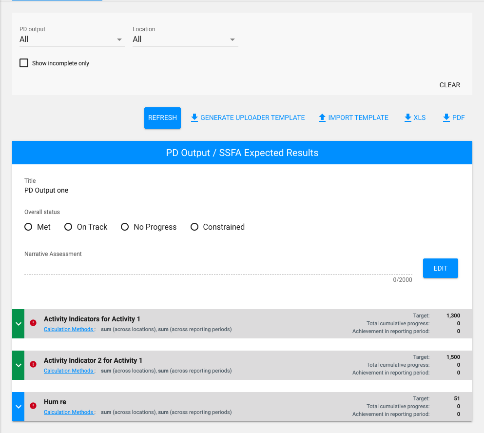
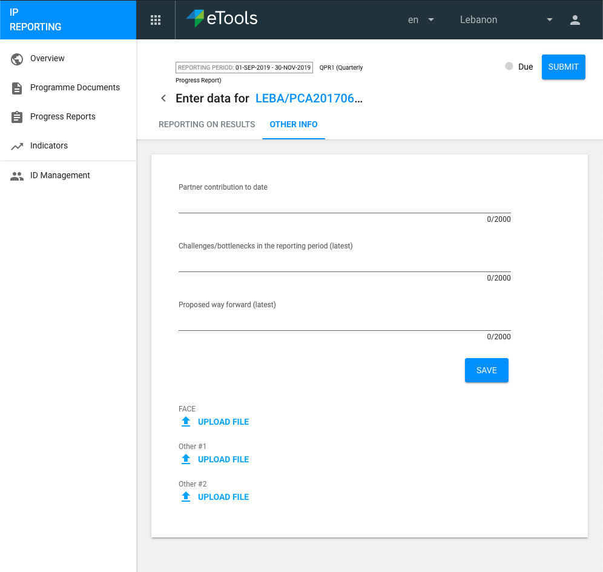
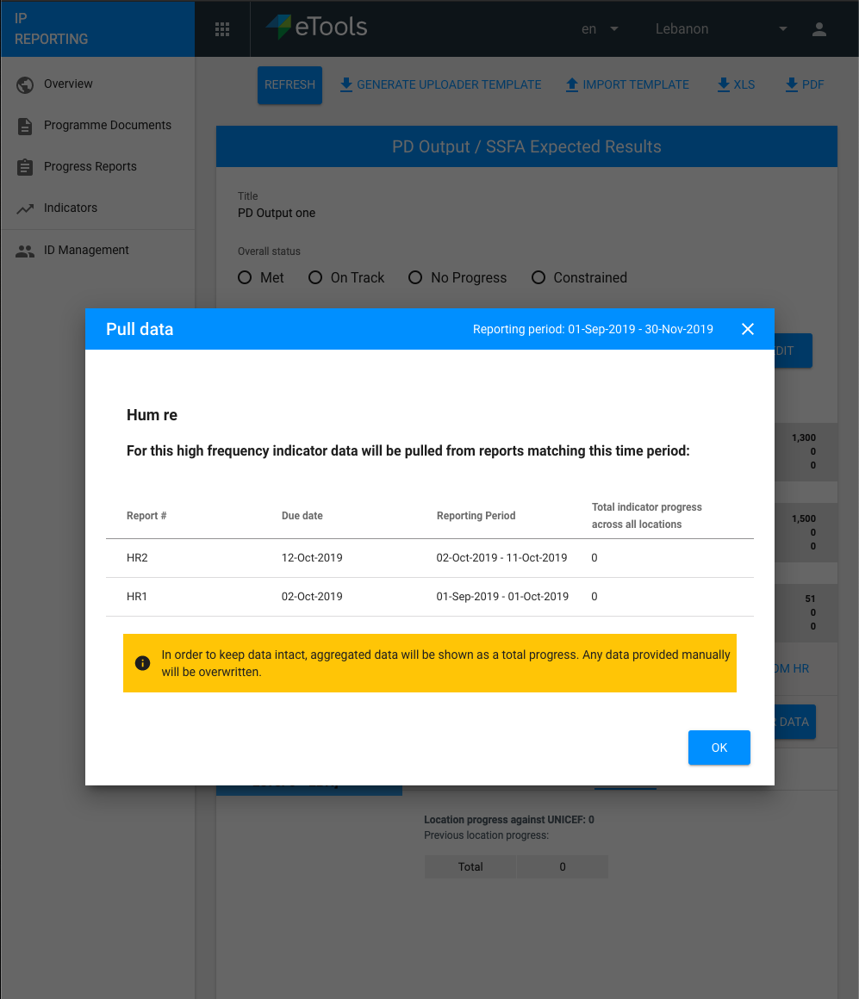

# Quarterly Progress Reports \(QPR\)

In this report, the IP provides the following information:

* Rating the progress against PD output\(s\) \(or SSFA expected result\(s\), if applicable\), including a short narrative assessment;
* For each PD output \(or SSFA expected result\), report progress against each and all indicators defined for the PD/SSFA in PMP, at the level of disaggregation defined, or above, if applicable. Including PD Output is mandatory \(\#[1015](https://github.com/unicef/etools-partner-reporting-portal/issues/1015)\)
* Other information as defined in the “other info” tab.

The frequency of reporting \(report start and end dates\) and report due dates are generated in PMP and the report is generated in PRP-IP on the first day of the new reporting period. Each report is assigned a number \(Eg. QPR-2\) and the final report is labelled "Final". If new reporting periods are added or changed after the “final” report has been generated, those changes/new reporting periods will be ignored for this PD.


The final report has a different rating options for PD outputs: "achieved as planned" or "not achieved as planned".


### **Reporting on High frequency humanitarian response Indicators**

If the PD includes high frequency humanitarian response indicators \(cluster or non-cluster\) the partner will be able to pull data for these indicators into the data entry table based on previous humanitarian indicator reports submitted by the IP in PRP-IP or PRP-Cluster. If there is no indicator report submitted then nothing can be pulled in. When the reporting periods for the quarterly progress reports and humanitarian reports do not match, the report will allow pulling in data already submitted by the IP falling within the current reporting period, if applicable. Data reported by the IP beyond the report end date will be allowed to be pulled in, in the subsequent QPR. The illustration of this is shown here:

In the above example, QPR 1 will be able to pull in aggregated data for high frequency and cluster indicators from Hum1 and Hum2. QPR 2 would be able to pull in data for the high frequency and cluster indicators from Hum3 and Hum4 and Hum5. 

When a user 'Pulls Data From HR' and QPR has non high frequency indicators, the backend will throw error message "This indicator is non-HF indicator. Data pull only works with HF indicator" \(\#[980](https://github.com/unicef/etools-partner-reporting-portal/issues/980)\).

  
Update 10/9/18 [\(\#891](https://waffle.io/unicef/etools-partner-reporting-portal/cards/5b96dbd9b97639001dd69a30)\)

> Pulling disaggregated data from HR to QPR
>
> There are 3 cases. It will pull totals only, it may pull partial, or may pull full. System looks at the first indicator data on each location and determines what type of data to pull. If the first indicator data on the location has totals only, then it will only pull totals moving forward for that indicator in the location from other HR reports.
>
> Example situations below.
>
> Indicator has Age, Gender, Height Disaggregation on Location A/B/C. The following steps will happen for each location:
>
> * Example 1:  The first report data on a location had only Age disaggregated data, then it will only get Age data from the other two. If the first report data on a location had Age + Gender + Height, then it will pull fully disaggregated data from the other two.
> * Example 2:  The first report data on a location had only Age + Gender disaggregated data, then it will pull the Age + Gender disaggregation data from the other two.
> * Example 3: The first report data on a location had only Age + Gender, but the second report data on a location has different disaggregation \(Age disaggregation only or totals only\), we will only pull totals only. In order to pull partial disaggregation, all report data on a location must have partial disaggregation.

Once data has been pulled in it can still be edited by the IP to be more accurate or for other reporting reasons.

QPR indicators \(HF cluster ones specifically\) will only always show PD locations set. Even if that shared indicator has more locations \(in cluster reporting\).

If the QPR report is submitted or accepted, then the 'Pull HR Data' button should not function and allow the user to overwrite the data \([\#981](https://github.com/unicef/etools-partner-reporting-portal/issues/981)\)

Annex C form will be generated when the report is submitted ****\([\#964](https://github.com/unicef/etools-partner-reporting-portal/issues/964)\)

