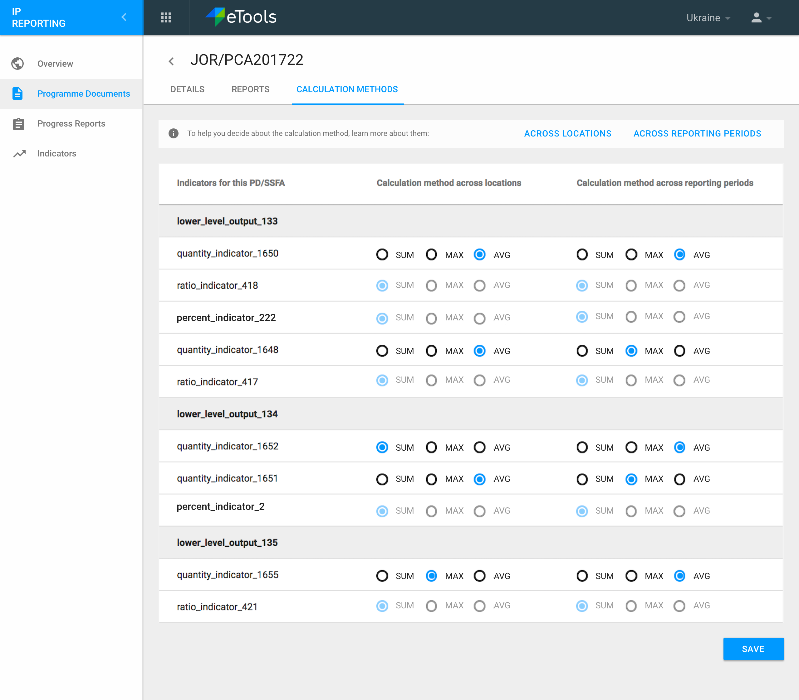
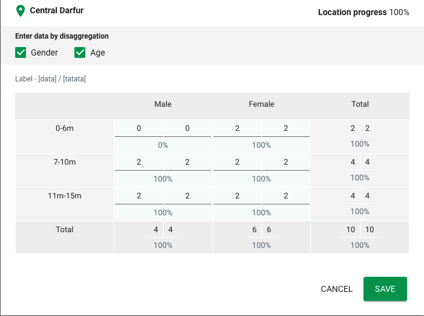
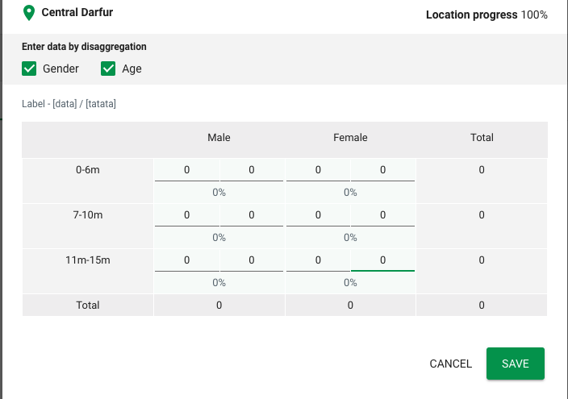
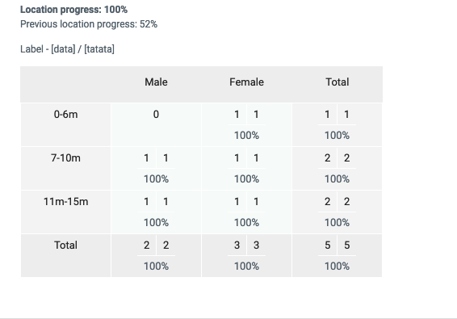

# Setting calculation methods for indicators

The IP can set the appropriate calculation method for each indicator in a PD. If a partner selects a Ratio or Percent indicator, the calculation method will be set to SUM and greyed out. They cannot change the calculation method unless it is a Quantity Indicator.

## Supported calculation methods \(Quantity Indicator Type\)

The following calculation methods are supported:

* Sum - simply adds data.
* Avg - The average of the data.
* Max - The maximum value in the period being looked at.

## Calculation method across locations \(Quantity Indicator Type\)

This represents how the IP would like to aggregate the data entered for all the locations in an indicator. Once applied this helps measure the total progress made on an indicator in a reporting period.

## Calculation method across reporting periods \(Quantity Indicator Type\)

This represents how the IP would like to aggregate the data entered across various reporting periods. This is what decides what progress has been made on an indicator at any given point of time.

The calculation method in this case is applied to the total progress made on an indicator in a reporting period \(not location level data at all\).

## Calculation method across locations \(Ratio Indicator Type\)

Ratio indicators calculation method is different from quantity indicators. For ratio indicators, the system adds the numerators & denominators separately at the location level and then divides them at the end for indicator report total \(\#[973](https://waffle.io/unicef/etools-partner-reporting-portal/cards/5bbe94b0699120004fb0633d)\).

It's possible to accept 0 for both numerator and denominator at the indicator location data entry time, indicating the data for corresponding disaggregations is _**no-progress**_. The 0/0 data entry will not affect calculations for subtotals and totals for the location.

If the location has all _**no-progress**_ data entries, then the total and subtotals will be 0.

## Calculation method across reporting periods \(Ratio Indicator Type\)

Calculation method is always latest for ratio indicator type. This calculation method is used to compute progress against the total for a indicator. This is done by simply grabbing indicator report total from the latest indicator report by the due date. \(\#[973](https://waffle.io/unicef/etools-partner-reporting-portal/cards/5bbe94b0699120004fb0633d)\)

## Percentage Display Type for Ratio Indicator Type

If the indicator has percentage display type, calculation methods across location and reporting periods are identical to the above sections. For percentage display type, the indicator report total value is multiplied by 100 so that the value is in percentage format. \(\#[973](https://waffle.io/unicef/etools-partner-reporting-portal/cards/5bbe94b0699120004fb0633d)\)

## Demo indicator table

When the IP user goes to set calculation methods, we will enable the user to be able to understand the impact their calculation method selection will have, by showing the user some example numbers / data for an example indicator.

When changing the calculation method and saving, we have a warning modal to that let's user know changing calculation methods will recalculate progress reports for their indicators \([\#875](https://github.com/unicef/etools-partner-reporting-portal/issues/875)\). We will send a notification email to UNICEF Focal point if the calculation method is changed for progress reports in PD that was previously submitted or accepted \(\#[462](https://github.com/unicef/etools-partner-reporting-portal/issues/462)\)

