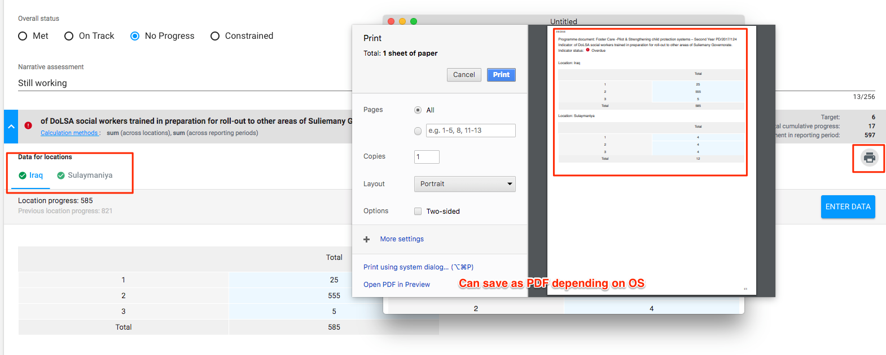

# Various data exports

### Exports Summary

| **PRP IP Page** | **PDF Export** | **XLS** **Export** |
| :--- | :--- | :--- |
| 1. Programme Documents \(list\) page | x | x  |
| 2. Single progress report page | x   |  |
| 3. Single progress report \(Annex C part 2\) | x    |  |
| 4. Single progress report data \( Annex C part 2 + disaggregated data\) |  | x    |
| 5. Progress reports list page for one PD \("Reports" tab in a PD\) | x   | x    |
| 6. Progress reports list page \(multiple PDs reports, multiple periods\) |   | x    |
| 7. Indicators \(list\) page | x    | x    |

Any of the exports that occur on a list screen or where a filter is applicable, will respect the selected filter by the user.

### Exports Details

#### \#1

Two buttons: "PDF" and "XLS" with download icons will be added to the PD list screen.

All the data associated with the PD is displayed in both formats. In excel as many columns as necessary. In PDF given constraints it will be displayed similar to how it is on web, to be easily readable/printable.

#### \#2

A "PDF" button with download icon will be added to the single Progress Report page.

This export will contain all the data associated with the report including data from the "other info" tab. Each output, its indicators, their progress per location will also be included in this export.

#### \#3

A "Annex C part 2" button with download icon will be added to the single Progress Report page. This option only shows when the report is either submitted or accepted.

This export will follow the Annex C part 2 standard format. It contains data from the "other info" tab, each output, its indicators and their total progress. **No** raw/disaggregated data is included in this export.

#### \#4

A "XLS" button with download icon will be added to the single Progress Report page.

This export will contain all the data associated with the report. Data from the "other info" tab will **not be included **in this export. Each output, its indicators, their progress and all raw/disaggregated data per location will also be included in this export.

XLS file will always be 1 tab with many rows and columns. Since each indicator could have different disaggregation choices and the partner could have reported at varying disaggregation levels as well, the columns represent all unique combinations of valid disaggregation choices and hence there might be a lot of empty cells. The overall status and narrative assessment would be repeated per indicator, even thought it was entered at the output level by the partner user.

#### \#5

Two buttons: "PDF" and "XLS" with download icons will be added to the reports tab in a single PD page.

The PDF export will include details of the PD along with all the reports \(similar to \#2 export\) data. The XLS export will be similar to \#4 above, but include progress reports for multiple reporting periods for this PD.

#### \#6

A "XLS" button with download icon will be added to the "Progress Reports" tab, which lists all progress reports across PD's and reporting periods.

The XLS export will be similar to \#5 above, but could include progress reports for multiple reporting periods for multiple PD's.

#### \#7

Two buttons: "PDF" and "XLS" with download icons will be added to the Indicator list screen.

**PDF**: This export will pretty much mirror what the user sees on the web application as much as possible. Meaning it will show the PD title, indicator title and progress to date.

**XLS**: The data exported will be very similar in format to \#4,5,6 above. It will contain \(if any\) the latest indicator report, and the previous to latest as well with disaggregated data details. Hence each indicator will have 2 rows per location in the XLS.

### Printing disaggregation tables / data

In the progress reports, users will have the capability to print the disaggregation tables / data easily. Please see screenshot of how this functionality would work.

