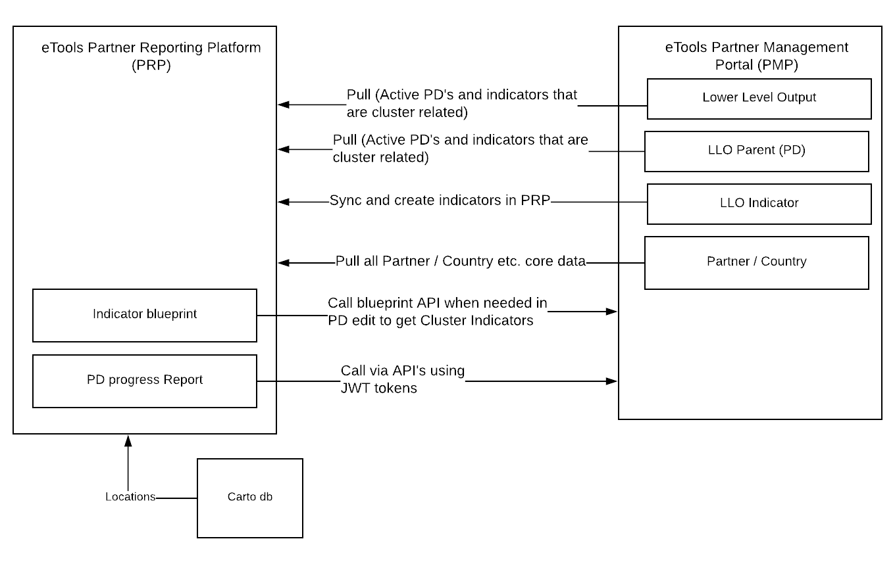

# Architecture

## Data Flow

The flow of data between PRP and any external systems is document here.

### PRP &lt;&gt; PMP

The diagram below represents the integration between PRP and PMP. Arrows represent the direction of data flow. PRP polls PMP for data on a regular basis. For indicator / progress reports etc. PMP makes live calls to PRP, directly from the users browser, using JWT tokens to authenticate / authorize. This helps reduce complexity of integration and also make it less bug-prone.

## Services

The platform is structured such that all the functionality is exposed via REST API's. The data from these API's drives the web interface which is a Single Page Application \(SPA\). There is a proxy that sits in front of the frontend SPA and backend API's. Additionally there is a message broker and asynchronous task / job queue that is used to run long-running and regular \(say every 1 hour or 1 day\) tasks.

Each of these services is either in the code and has an associated Dockerfile describing how it can be built and deployed on a docker friendly environment. Or this service uses a readily available Docker image that we configure for our own use.

The implementation details of each of these services is as follows:

* **Django API** - This is the backend REST API service. Uses [Django](https://www.djangoproject.com/) and [Django REST Framework](http://www.django-rest-framework.org/).
* **Polymer frontend** - This is the SPA written in [Polymer](https://www.polymer-project.org/).
* **Nginx proxy** - This sits in front of the Django and polymer services and routes requests. This helps us to not run these services on different ports for example, that would cause CORS issues.
* Redis
* Celery Beat
* Celery workers
* PostgreSQL database

