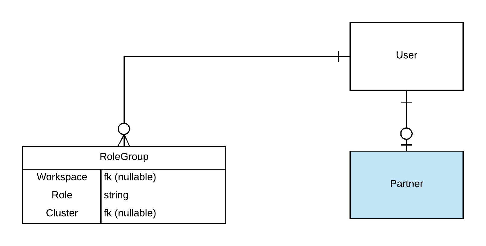

# ID Management

ID management in PRP should be its own application `id_management`.

The primary data model relationships that supports ID management in PRP is depicted below. The `User` model is associated with one `Partner` instance \(none in case of an internal user\). Additionally there is a One To Many relationship from the `User` model to a new model called `RoleGroup`. This represents a unique role this user has in the context of a Workspace \(used for IP\) or a Cluster \(used for Cluster\).

The backend API's are written with the help of Django REST Framework like the rest of PRP. The frontend however is its own service, written as a [React](https://reactjs.org/) Single Page Application \(SPA\).

